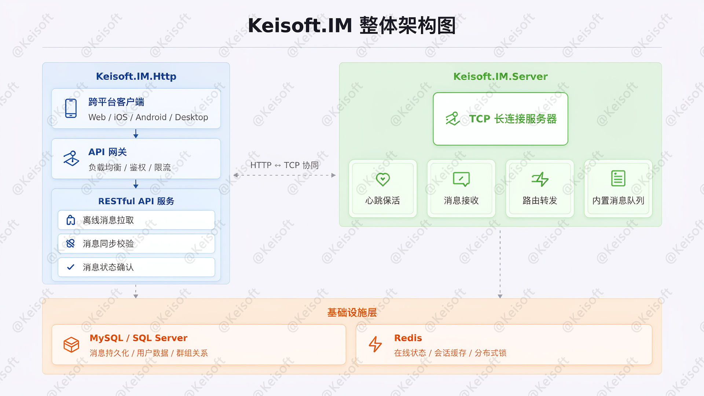
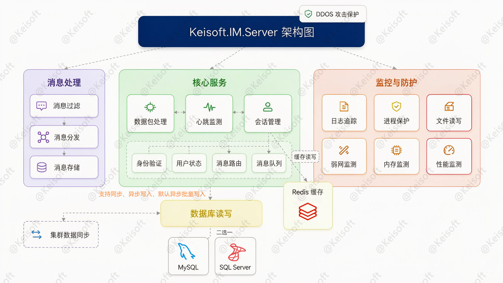
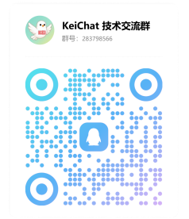

<h1 align="center">Keisoft.IM —— High-Performance .NET Instant Messaging Backplane</h1>

<p align="center">
  <strong>"Massive Connections, Millisecond Delivery" —— Redefining the Performance Boundaries of Real-Time Communication for .NET</strong>
</p>
<p align="center">
<a href="https://dotnet.microsoft.com/"></a>
<a href="https://learn.microsoft.com/dotnet/core/deploying/native-aot/"></a>
<a href="https://www.mysql.com"></a>
<a href="https://www.microsoft.com/zh-cn/sql-server"></a>
<a href="https://redis.io"></a>

<a href="https://nginx.org"></a>
<a href="LICENSE"></a>
<a href="https://github.com/macroecho/keisoft.im/stargazers"></a>
</p>


**English** | [简体中文](README.md)

----


## 📖 Introduction

&emsp;&emsp;**Keisoft.IM** is a low-level communication system focused on handling **massive TCP long connections**, **heartbeat keep-alive**, and **high-performance message routing and forwarding**. As a pure communication backplane, this project **contains no business logic** and aims to provide ultimate connection management and message transmission capabilities for upper-layer applications. The system adopts a layered decoupled design, divided into the **WebAPI Layer** (responsible for offline messages and state synchronization) and the **TCP Long Connection Layer** (responsible for connection maintenance and real-time push). The **TCP Long Connection Layer** deeply references the core design philosophy of **Netty**, completely abandoning the drawbacks of .NET native `Socket` when handling high concurrency (such as frequent context switching and severe lock contention), easily supporting **100K+ concurrent connections** with message latency controlled within **1-100ms**.

&emsp;&emsp;This project started in **2018**, initially developed synchronously as the underlying communication engine for the **[KeiChat](#-related-repositories)** project. Before open-sourcing, **Keisoft.IM** served as the core driving engine for an enterprise's internal communication tools, supporting thousands of employees in daily instant messaging, file transfers, and online collaboration. **Keisoft.IM** is not a half-baked product rushed to completion; rather, it has been repeatedly polished in production environments, undergoing dozens of performance tunings and architectural iterations to become the stable, efficient, and battle-tested communication backplane it is today.

> Keisoft.IM focuses on massive TCP long connection governance · Heartbeat keep-alive · Message routing and forwarding · Zero business logic coupling · 🧩 Business systems can perform secondary development based on this backplane.

---


## 🏗️ System Architecture Overview

The project consists of two core modules:

```text
.
├── WebAPI              # 🌐 HTTP API Service (Offline messages & Sync verification)
└── TcpServer           # 📡 TCP Long Connection Service (Communication Core)
```



---


## 🌐 WebAPI —— Offline Messages & Sync Verification

The WebAPI does not participate in real-time communication and only provides auxiliary capabilities:

1. **Primary Responsibilities**

   - 📥 Offline message pulling (Pull mode).

   - 🔁 Message synchronization verification (prevent loss and out-of-order).

   - 🧾 Message status confirmation (delivered / synchronized).

2. **Design Principles**

   - Stateless design, easy horizontal scaling.
   - Interacts only with the storage layer, unaware of connections.
   - Provides eventual consistency guarantees for weak network / reconnection scenarios.

----


## 📡 TCP —— High-Performance TCP Long Connection Service

A **.NET 9** console application compiled into an **AOT native image** using **AOT (Ahead-of-Time)** compilation mode. It compiles C# source code into IL via Roslyn, which is then directly compiled into native machine code for a specific platform by the Native AOT compiler (ILC), generating a standalone executable that does not depend on the .NET runtime.



#### 💡 The TCP service deeply references the core concepts of the Netty framework at the underlying design level and introduces the Libuv cross-platform asynchronous I/O library.

1. **Reactor Thread Model**

   - **Boss Thread (Main Reactor)**: Based on Libuv's `uv_tcp_t` listening handle, dedicated to accepting client connections. After a connection is established, `uv_accept` is used to obtain the new socket, which is then registered to a Worker thread via round-robin or consistent hashing strategy.
   - **Worker Thread Pool (Sub Reactor)**: Each Worker runs an independent Libuv Event Loop, bound to a set of client connections, responsible for all I/O read/write, heartbeat detection, and protocol encoding/decoding for those connections. The number of threads aligns with the number of CPU cores by default, maximizing multi-core utilization and avoiding context switching overhead.

2. **Zero-Copy Buffer Management**

   - Uses `ArrayPool<byte>` for pre-allocated memory pools, combined with Libuv's `uv_buf_t` directly referencing pinned areas of managed memory (via `GCHandle`), avoiding unmanaged copying.
   - Utilizes .NET `Pipe` to achieve zero-copy message flow during encoding/decoding (`ReadOnlySequence<byte>`).
   - Buffers automatically scale with the connection lifecycle, avoiding new memory allocations during traffic spikes.

3. **Efficient Event-Driven**

   - The Libuv Event Loop is based on the OS's optimal readiness notification mechanism (Linux epoll / macOS kqueue / Windows IOCP). Events are processed immediately upon triggering, with no busy-waiting.
   - Blocking file operations (such as Journal log writing) are automatically offloaded to the Libuv internal thread pool, ensuring the I/O event loop is never blocked.
   - Avoids creating independent threads for each connection, keeping memory usage constant.


#### 🛡️ Message Filtering

In instant messaging systems, content security is an insurmountable bottom line. However, deep risk control logic (such as semantic analysis, contextual understanding, and external API calls) is often time-consuming. If executed synchronously, it would directly slow down message delivery latency. To this end, **Keisoft.IM.Server** designs a **two-phase message filtering mechanism**, achieving a precise balance between **security** and **performance**: **Keisoft.IM.Server** only performs lightweight sensitive word scanning internally, while heavy risk control logic is decoupled asynchronously. This not only ensures extremely low latency for message delivery but also leaves no security holes.

1. **Phase 1: Lightweight Sensitive Word Scanning within TCP Service (Synchronous, Latency-Sensitive)**

   After a message is routed to its target and before being written to the send queue, it first passes through a lightweight filter:

   - **Algorithm**: Based on **Double-Array Trie** to build a sensitive word dictionary tree, performing an `O(n)` linear scan on message content. Time complexity is proportional to text length and independent of dictionary size.
   - **Performance**: Single scan time is stable at the **microsecond (μs) level**, executed synchronously within the Worker thread, without blocking the I/O event loop or affecting end-to-end latency.
   - **Interception Action**: When a violation word is hit, the message executes a specific action based on the `actionType` in the sensitive word library, and is then dropped into an asynchronous queue to be reported to the risk control system.

2. **Phase 2: Asynchronous Deep Risk Control (Asynchronous, Security Fallback)**

   For content requiring complex logic judgment, an independent risk control service cluster asynchronously consumes and processes it:

   - **Decoupling**: The risk control service is completely decoupled from the TCP service, allowing independent scaling without affecting the main long-connection path.
   - **Deep Analysis**: The risk control service performs heavy logic such as NLP semantic analysis, regex engines, contextual correlation, and third-party security API calls.
   - **Post-action**: If deemed violating, actions such as muting/banning the user are executed.

3. **Configuration File Example**

   ``` json
   {
      // ... omitted

     // Message filtering configuration options.
     "MessageFilterOptions": {
       // Sensitive word filtering configuration options.
       "SensitiveOptions": {
         // Enable sensitive word scanning feature set to true.
         "IsEnabled": true,
         // Enable local scanning set to true.
         // 1. Set to true to scan locally against the sensitive word library first, execute specific actions based on the library requirements, and then asynchronously report to the remote service.
         // 2. Set to false to call the interface for scanning every time and wait for the result, which may degrade performance.
         "IsUseLocalScan": true,

         /*
          * Load sensitive words API address (GET request).
          * This interface is custom and must follow these rules:
          *
          * 1. Standard RESTful API, successful HTTP status code is 200, returning:
          * 	[{"wordText":"sensitive word","matchType": 1,"actionType":1}] without wrapping in code, message, data, etc.
          *  On failure, HTTP status code is non-200, returning:
          *	{"code": "errorCode", "message": "Specific error message"}
          *
          * 2. Parameter description:
          * 	matchType: 1=Exact, 2=Fuzzy, 3=Regex
          * 	actionType: 0=None, 1=Record, 2=Replace, 4=Block
          * 	Combination actions use bitwise operations: None = 0, Record = 1 << 0, Replace = 1 << 1, Block = 1 << 2, e.g.: actionType = Record | Replace;
         */
         "LoadUrl": "http://localhost:6006/sensitiveWord/list?X-API-KEY=osaViiBrVTKgF04HlLRBXX4ETy5I2s56",
         "LoadApiKye": "osaViiBrVTKgF04HlLRBXX4ETy5I2s56",

         /*
          * Scan sensitive words API address (POST request).
          * This interface is custom and must follow these rules:
          *
          * 1. Request data format is "application/json", example:
          *	{"userId":10000,"sourceId": "10200900","sourceType":1,"sourceContent":"Message content","clientIp":"127.0.0.1"}
          *
          * 2. Request parameter description:
          * 	userId: User ID
          * 	sourceId: Message ID
          * 	sourceType: Source type, 1=Private chat, 2=Group chat
          * 	sourceContent: Message content
          * 	clientIp: Client network address
          *
          * 3. Response requirement: successful HTTP status code is 200, returning: {"action":2,"filteredText":"You***"}
          * On failure, HTTP status code is non-200, returning: {"code": "errorCode", "message": "Specific error message"}
          *
          * 4. Response parameter description:
          * 	action: Executed action, 0=None, 1=Record, 2=Replace, 4=Block
          * 	filteredText: Filtered content
         */
         "ScanUrl": "http://localhost:6006/riskScanner/sensitiveScan?X-API-KEY=osaViiBrVTKgF04HlLRBXX4ETy5I2s56",
         "ScanApiKye": "osaViiBrVTKgF04HlLRBXX4ETy5I2s56"
       }
     }
   }
   ```


#### 📨 Message Routing

1. Maintains a global connection routing table in memory (UserId → ServerInstance → WorkerId).
2. After a message arrives, the routing engine queries the node where the target connection resides, delivers it to the user session's message queue, and then hands it over to **Message Dispatching** for processing.
3. When the target client is offline, the message is automatically transferred to offline storage and pulled actively via HTTP upon the client's next connection.


#### 📤 Message Dispatching

In scenarios with massive long connections, how to efficiently and fairly push messages to clients after the routing engine determines the target connection is key to determining the overall system latency and stability. The TCP service provides two message dispatching modes and introduces an adaptive flow control mechanism based on client processing capabilities, ensuring that slow clients do not drag down overall service performance.

1. **Mode 1: Round-Robin Dispatching**

   - **Fair Scheduling**: Uses a round-robin strategy among multiple target clients, sequentially writing messages to each connection's send queue, ensuring every client gets a fair chance to process messages, avoiding long-term starvation due to connection order.
   - **Indiscriminate Pushing**: Assumes all clients have equal processing capabilities, dispatching in iteration order, simple and efficient.

2. **Mode 2: Maximum Active Count Dispatching**

   In real production environments, client network conditions and processing capabilities vary greatly. If the server pushes messages at a uniform rate to all clients, poorly connected or weak clients will cause server send buffer backlogs, triggering frequent GC or thread blocking, thereby affecting message arrival rates for other normal clients (the Head-of-Line Blocking problem).

   To address this, referencing Netty's `ChannelOutboundBuffer` and WriteBufferWaterMark flow control concepts, we implemented a **three-tier adaptive rate dispatching mechanism**:

   - **Client Capability Evaluation Dimensions**:
     1. TCP send buffer water level (Socket Send Buffer occupancy rate).
     2. Client ACK delay after message push (RTT).
     3. Heartbeat response time.
     4. Consecutive send timeout/failure count.
     5. Channel `IsWritable` status.
   - **Three-Tier Queue Isolation (Fast / Medium / Slow Tracks)**:
     1. 🟢 **Fast Track**: Clients with good network and strong processing power, send buffer consistently low. The system pushes messages at maximum rate (or even batched), with end-to-end latency as low as 1-30ms, providing a lightning-fast experience for normal clients.
     2. 🟡 **Medium Track**: Clients experiencing occasional network jitter, send buffer starting to backlog. The system automatically reduces the push rate for these clients, decreasing the number of messages pushed per batch, giving the client buffer time to prevent further deterioration.
     3. 🔴 **Slow Track**: Clients with extremely poor network or application-layer stalls, send buffer consistently high (or frequently triggering TCP zero window). The system moves them to the slow queue, drastically reducing push frequency or even temporarily suspending sending (Backpressure mechanism) until the client buffer is freed or the heartbeat returns to normal, thus **not affecting message dispatching for normal clients**.
   - **Dynamic Upgrade/Downgrade**:
     1. Client status is not static. The system monitors metric changes for each connection in real-time via background probing threads.
     2. When a slow client's network recovers and the buffer is drained, it is automatically upgraded from the slow queue to medium or fast track, resuming normal message reception rate.
     3. This mechanism achieves perfect **Performance Isolation**, ensuring "slow clients do not drag down fast clients".

3. **Configuration File Example**

   ``` json
   {
     // ... omitted

     // Message dispatching configuration options
     "MessageDispatchOptions": {
       // Dispatching mode
       // RoundRobin: Round-robin message dispatching.
       // UnFair:
       //    Determines the dispatching speed based on the client's message processing capability.
       //    Consists of Fast, Medium, and Slow dispatching. Clients that process messages quickly are placed in the Fast queue, allowing normal clients to receive messages promptly.
       //    Clients that process messages slowly (indicating poor network) are placed in the Slow queue, thus not affecting the dispatching of messages to normal clients.
       "Model": "UnFair",
       // UnFair Fast interval (unit: seconds).
       "MinInterval": 5,
       // UnFair Medium interval (unit: seconds).
       "MediumInterval": 15,
       // UnFair Slow interval (unit: seconds).
       "MaxInterval": 25
     }
   }
   ```

#### 📬 Reliable Message Delivery & Anti-Loss Mechanism (TCP + HTTP Collaboration)

In instant messaging systems, anomalies like network flickers, client crashes, and server restarts are inevitable. To ensure messages are **not lost, not duplicated, and arrive in order** between the client and server, **Keisoft.IM** builds an **application-layer reliable delivery protocol**, perfectly combining the real-time nature of TCP long connections with the reliability compensation of HTTP short connections.

1. **TCP Real-time Channel: Application-level ACK Confirmation**

   Although the TCP transport layer guarantees reliable packet transmission, it cannot perceive the application-layer message processing status. Therefore, the system introduces an end-to-end confirmation mechanism at the application layer:

   - **Push and Confirm**: After the server pushes a message to the client via a TCP long connection, the client must return an **Application-level ACK** within a specified time (containing the message's unique sequence number).
   - **Timeout Retransmission**: If the server does not receive an ACK within the timeout window, it will re-push based on the three-tier queue dispatching mechanism (possibly at a reduced rate). If unconfirmed multiple times consecutively, the client is determined to be offline or abnormal, triggering message offline storage.
   - **Deduplication Mechanism**: Clients perform idempotent processing based on the message's unique sequence number to prevent duplicate pushes caused by network jitter.

2. **HTTP Compensation Channel: Offline Pulling & Sync Verification**

   When the TCP connection is unavailable (client offline, network switch, server restart), the HTTP interface becomes the last line of defense for message reliability:

   - **Offline Message Pulling**: After the client comes online, it first pulls offline messages via the HTTP interface (based on incremental pulling of message sequence numbers) to ensure no historical messages are missed.
   - **Message Sync Verification**: The client reports the maximum sequence number of locally received messages, along with the total message count from the last synced sequence number to the current maximum sequence number. The server compares the stored sequence numbers and message counts, returning a list of missing messages. This ensures that even if the TCP channel is briefly interrupted, messages can be eventually replenished via the HTTP channel.
   - **Confirm Deletion**: After the client successfully processes offline messages, it can notify the HTTP server to delete the pulled offline records (using the client-reported maximum message sequence number as a condition) to prevent duplicate delivery.

#### 💾 Message Storage

In terms of message persistence, high-reliability synchronous and asynchronous storage solutions are provided to ensure reliability during routing and forwarding and the system's high performance. A Journal file is introduced as a buffer layer before database writing. Supports **MySQL** and **SQL Server** relational databases, switchable via the configuration file `RepositoryOptions:Type`.

1. **Synchronous and Asynchronous Storage Modes**

   - **Synchronous Storage**: Messages are written to the database immediately upon arrival, guaranteeing strong consistency but increasing message processing latency. Suitable for special scenarios with extremely high data reliability requirements.
   - **Asynchronous Storage (Default)**:
     1. **Journal File**: Messages are first written sequentially (Append-Only) to a local disk Journal file. Sequential disk writing has extremely high performance and almost no impact on the main message processing flow.
     2. **Batch Asynchronous Persistence**: Background threads periodically (default 60s) or when the Journal file accumulates to a certain batch size (default 5000 entries), batch write messages to MySQL or SQL Server.
     3. **Crash Recovery**: If the service crashes unexpectedly, upon restart, the system automatically reads un-persisted messages from the Journal file and re-persists them, ensuring zero message loss.

2. **Group Message Storage**

   In large-scale instant messaging systems, group message storage faces the classic architectural trade-off between **Write Diffusion** and **Read Diffusion**:

   - **Write Diffusion Model**: Each group message writes one offline message record for each member in the group. The advantage is that reading requires only one query to get all messages; however, in large group scenarios (e.g., 500 or 2000 people), a single message triggers hundreds or thousands of database write operations, causing severe **Write Amplification**, drastically increasing database IOPS pressure and becoming a system bottleneck.
   - **Read Diffusion Model**: Group messages are persisted as **a single group message** to the database, while maintaining a **reference count** and **Timestamp** for group messages. When a client pulls group messages, the server reads incremental messages from the group message table based on the client's synchronized message number and the member's group join timestamp, and distributes them in real-time to online members in the group.
   - Therefore, **Keisoft.IM** adopts the **Read Diffusion Model** for group message storage.

3. **Configuration File Example**

   ``` json
   {
     // ... omitted

     "RepositoryOptions": {
       // Options: MySql, SqlServer
       "Type": "MySql",
       // MySql
       "MySqlOptions": {
         "ConnectionString": "Server=127.0.0.1;Port=3306;Uid=root;Pwd=example@123;DataBase=keisoft_im;CharSet=utf8mb4;",
         // Starting value of the message sequence number. If the database is migrated, this value must be greater than the message sequence number in the historical data.
         "StartSequenceNumber": 0
       },
       // SqlServer
       "SqlServerOptions": {
         "ConnectionString": "Data Source=.;Initial Catalog=Keisoft.IM;Uid=example;Pwd=example@123;TrustServerCertificate=true;",
         // Starting value of the message sequence number. If the database is migrated, this value must be greater than the message sequence number in the historical data.
         "StartSequenceNumber": 735000
       }
     },
     "MessageStorageOptions": {
       // Options: Sync, Async
       // Sync: Directly persist to the database, return message sent successfully after landing in the database.
       // Async: First store in the data/msg.db disk file to ensure messages are not lost, then asynchronously batch persist to the database to reduce database pressure.
       "Model": "Async",
       // Interval for batch storage to the database (unit: seconds).
       "Interval": 60,
       // Or store to the database once the message count exceeds 5000.
       "MaxNumber": 5000,
       // Use AES-GCM to encrypt stored messages set to true.
       "UseEncrypt": true,
       // AES-GCM Key (128-bit / 16 bytes).
       "SecretKey": "CGkJri5mbIo9VGxogWwVig=="
     }
   }
   ```

----


## 🧪 Development Environment Requirements

- Windows 10/11
- .NET 9 SDK
- Visual Studio 2022+

---


## 🚀 One-Click Deployment (Docker Compose)

#### 1. Quick Start

- 📦 Install [Docker](https://www.docker.com/) and [Docker Compose](https://docs.docker.com/compose/)

- 💡 Ensure the default `TCP Communication Service` port `18168` is not occupied (or you can reassign a new port in docker-compose.yml).

- ⚠️ **Must modify the following configurations in `docker-compose.yml` before deployment**:

  - `TcpServiceAddress__0`: Set the public network address of the TCP communication service.

  ```bash
  # 1. Clone the repository
  git clone https://github.com/macroecho/keisoft.im.git
  cd Keisoft.IM

  # 2. Extract Keisoft.IM.Server
  tar -xzf Keisoft.IM.Server/x64-1.0.8.tar.gz -C Keisoft.IM.Server

  # 3. Start all services with one click (run in background)
  docker compose up -d
  ```

#### 2. Nginx Configuration (`nginx.conf`)

- ⚠️ Modify the domain names or certificates in configuration files like `Keisoft.IM.Http/nginx.conf`, and then add them to `nginx.conf`.

  ```nginx
  http
  {
      server
      {
      	listen 888;
        	# ... omitted
      }

      # ... omitted
      # Load keisoft.IM configuration file
      include /www/wwwroot/Keisoft.IM/Keisoft.IM.Http/nginx.conf;
  }
  ```

---


## 🧭 Client Usage Guide

**Keisoft.IM** provides the .NET client SDK `Keisoft.IM.Client`, which can be quickly integrated into your project via NuGet.

1. **Install NuGet Package**

   ``` c#
   dotnet add package Keisoft.IM.Client
   ```

2. **Establish TCP Long Connection**

   ``` c#
   var clientOptions = new ClientOptions
   {
       // Fill in the Keisoft.IM.Http gateway address here. Default is 'im' for http, 'ims' for https.
       ServerHost = "ims://example.com",
       // Keisoft.IM.Http gateway port. Default is 80 for Http, 443 for Https. (Unless a custom port is used)
       ServerPort = 18169,
       // Implement the Keisoft.IM.Client.Logger.ILogger interface to write a logging class.
       Logger = new IMServiceLogger(),
       // File path for the local message database.
       DbPath = "msg.db",
       // Password for the local message database.
       DbPassword = "example",
       // Default message content filter.
       MessageContentFilter = new SimpleMessageContentFilter(),
       // Public key certificate for TLS encrypted communication, exported from the PFX certificate (.pfx) bound to Keisoft.IM.Server. Both belong to the same key pair.
       Certificate = X509CertificateLoader.LoadCertificateFromFile("im.crt")
   };

   // Initialize.
   IMClient.Init(clientOptions);
   // Connection response event.
   IMClient.SetOnConnection(response => { });
   // Receive messages pushed by the service.
   IMClient.SetOnReceiveMessage(messageItems => { });

   // Connect to Keisoft.IM.Server service.
   // userId: User ID imported into the Keisoft.IM system.
   // token: User identity token, generally returned by the business system's login interface. The backend business system's login interface uses the /IdentityRpc/Token interface in Keisoft.IM.Http to generate the token.
   await IMClient.ConnectAsync(userId: 10000, token: "202CB962AC59075B964B07152D234B70");
   ```

3. **Send Message**

   ``` c#
   // Globally listen for message sending results, so you don't need to pass a callback function when sending.
   // IMClient.SetOnSendMessageResponse(messageItems => { });

   var subType = (byte)MessageSubTypeEnum.TextMessage;
   // Build a text message.
   var sendMessage = await IMClient.MakeMessageAsync(to: 10001, type: MessageType.Private, subType: subType, content: "text content");
   // Send the message to the server.
   await IMClient.SendMessageAndFlushAsync(sendMessage, response =>
   {
       // Send status response.Status
   });
   ```

----


## ⚖️ Terms of Use and Disclaimer

**1. Legal Use**: Your use of this system is subject to the following conditions: You acknowledge and agree to use this system solely for lawful purposes and to comply with all applicable laws and regulations, including but not limited to the laws of your jurisdiction, the place where the act occurs, and the place where the target impact occurs. You shall not use this system to engage in any act that infringes upon the legitimate rights and interests of others, violates legal provisions, or endangers network security.

> If you violate any of the above conditions, this authorization terminates immediately, and you must immediately stop using the system and delete all related copies. You shall bear all legal responsibilities arising from your violation of this statement, and the project maintainer reserves the right to pursue legal liabilities.

**2. Open Source Nature**: This project is provided in open-source form for learning, research, and technical exchange. The developer makes no express or implied warranties regarding the functional integrity, security, stability, or suitability of this system.

**3. No Warranty**: To the maximum extent permitted by law, the developer shall not be liable for any direct, indirect, incidental, special, or consequential damages arising from the use or inability to use this system, including but not limited to data loss, business interruption, or other commercial damages.

**4. Risk Assumption**: You understand and agree that all risks arising from the use of this system are borne by you, including but not limited to system vulnerabilities, third-party dependency risks, and runtime environment risks.

**5. Intellectual Property**: The intellectual property rights of this system and related code and documentation belong to the **original author**. Without written permission, this system shall not be used for commercial purposes or altered or redistributed without authorization.

---


## 💬 Technical Discussion Group

Welcome to join the KeiChat technical discussion group to exchange ideas on **.NET, WPF, Avalonia, Xamarin, WebRTC, Real-time Audio/Video Communication, IM Architecture, Multi-process Design**, and more 👇



- **QQ Group Number**: 283798566
- **How to Join**: Scan the QR code to join or apply via QQ search with the group number.
- **Discussion Topics**: .NET, C#, Real-time Audio/Video Communication, IM Architecture, Project Issue Discussion

> 💡 Friends without QQ can also leave messages in GitHub Issues for discussion.

---


## 📄 License

MIT License

---

<p align="center">
  ⭐ If Keisoft.IM helps you learn about instant messaging, please give it a Star!
</p>
